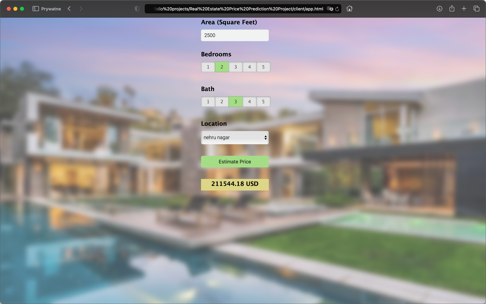

# Real Estate Price Prediction Project

## Introduction
Creating a Machine Learning model to predict the home prices in Bangalore, India. We are going to use the dataset from Kaggle.com.
We are also going to create a single page website which will provide the front end to access our model for predictions.

The following data science concepts are used in this project:
* Data loading and cleaning
* Outlier detection and removal
* Feature engineering
* Data Scaling and Normalization
* Dimensionality reduction
* GridSearchCV for hyperparameter tunning
* K-Fold cross validation 

Technology and tools used in this project:
* Python
* Numpy and Pandas for data cleaning
* Matplotlib for data visualization
* Sklearn for model building
* Jupyter Notebook, Visual Studio Code and PyCharm as IDE
* Python flask for http server
* HTML/CSS/Javascript for UI

## Steps
1. We will first build a model using sklearn and linear regression using banglore home prices dataset from kaggle.com. ([model folder](model))
2. Second step would be to write a python flask server that uses the saved model to serve http requests. ([server folder](server))
3. Third component is the website built in html, css and javascript that allows user to enter home square ft area, bedrooms etc and it will call python flask server to retrieve the predicted price. ([client folder](client))

  ```
  Step#1: Import the required libraries
  Step#2: Load the data
  Step#3: Understand the data
          - Drop unnecessary columns
  Step#4: Data Cleaning
          - Check for NaN values
          - Verify unique values of each column
          - Make sure values are correct (e.g. 15 BHK home with 2000 Sqrft size is wrong)
  Step#5: Feature Engineering
          - Dimesionality Reduction
          - Outlier removal using domain knowledge (2bhk price < 3bhk price, size per bhk >= 300 sqft)
          - Outlier removal using standard deviation and mean 
  Step#6: Build Machine Learning Model
          - One Hot Encoding
          - Separating dependent and independent features
          - Spliting the data for training and testing
          - Using K-Fold cross validation to measure accuracy
          - Using the GridSearchCV method to find the best algorithm for our model
  Step#7: Testing the model
  Step#8: Exporting
  ```

## Dataset Reference
* [Bengaluru House price data](https://www.kaggle.com/datasets/amitabhajoy/bengaluru-house-price-data/data)
* I have also uploaded the csv file in this repository [Bengaluru_House_Data.csv](model/Bengaluru_House_Data.csv) 

Reference
[codebasics](https://www.youtube.com/playlist?list=PLeo1K3hjS3uu7clOTtwsp94PcHbzqpAdg)

## Client UI

